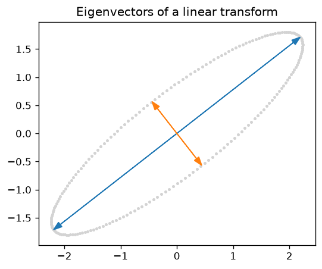
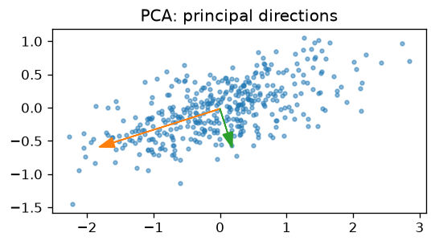
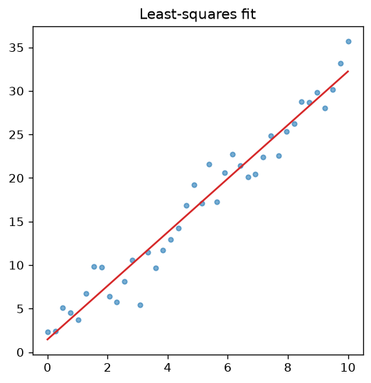
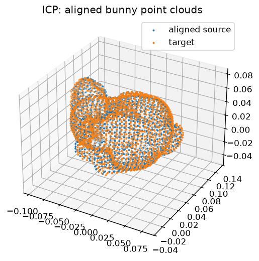

# Linear Algebra Playground

Four small, visual projects that make core linear algebra concepts tangible: matrix transforms and eigenvectors, PCA, least squares, and SVD-based rigid point cloud registration (ICP). Each notebook pairs a short conceptual explanation with a from-scratch NumPy implementation and a plot you can actually see the math in.

[](https://github.com/P76071226/linear-algebra-playground/actions/workflows/tests.yml)

## Setup

```bash
git clone https://github.com/P76071226/linear-algebra-playground.git
cd linear-algebra-playground
uv sync
uv run jupyter lab
```

## The four projects, in build order

### 01 — [Transform Playground](notebooks/01_transform_playground.ipynb)
Drag the entries of a 2x2 matrix and watch a grid of points and a unit circle deform in real time, with eigenvectors overlaid to show which directions the matrix leaves unchanged.



### 02 — [PCA](notebooks/02_pca_point_cloud.ipynb)
Find the directions a point cloud actually varies along, from a hand-built covariance-and-eigenvector implementation — first on synthetic data, then on a real 30-feature medical dataset reduced to 2D.



### 03 — [Least Squares](notebooks/03_least_squares_fitting.ipynb)
Fit noisy data by solving the normal equations from scratch, then use Anscombe's quartet to see why the same fitted line can hide very different underlying data.



### 04 — [ICP Registration](notebooks/04_icp_registration.ipynb)
Align two copies of the Stanford Bunny point cloud — one rotated and translated from the other — using an SVD-based rigid transform solver wrapped in an iterative nearest-neighbor loop.



## Note on interactive notebooks

Some notebooks use `ipywidgets`/`ipympl` sliders, which only respond when run locally (`uv run jupyter lab`) — GitHub's notebook preview shows the last-saved static output only. Each interactive section also has a static plot alongside it so the idea comes across either way.

## Running the tests

```bash
uv run pytest -v
```

Every hand-implemented core function (rotation/scale/shear builders, PCA's covariance + eigendecomposition, the least-squares normal-equation solver, ICP's SVD-based rigid transform) is cross-checked against NumPy/SciPy/scikit-learn reference implementations or a known closed-form ground truth.

## License

MIT — see [LICENSE](LICENSE).
